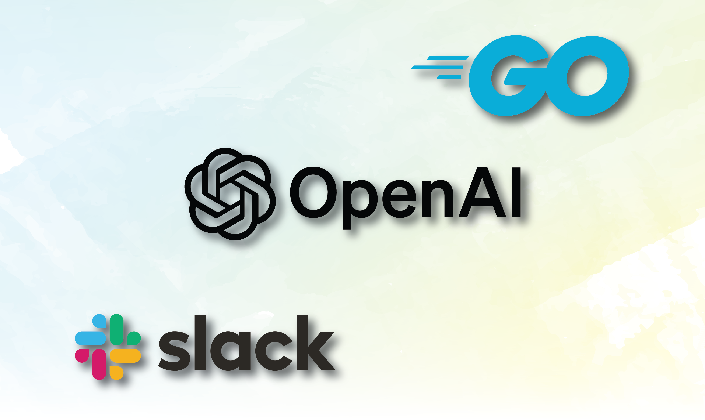

# SlackBot with Go & OpenAI




## Dependencies

Install the below packages

```bash
$ go get github.com/sashabaranov/go-openai
$ go get github.com/aws/aws-sdk-go
$ go get -u github.com/slack-go/slack
```

### Building Docker Image
```
$ docker build -t go-lambda:latest .
```


### Creating Function

```bash
aws lambda create-function --function-name hello-world --package-type Image --code ImageUri=254501641575.dkr.ecr.ap-south-1.amazonaws.com/go-lambda:latest --role arn:aws:iam::254501641575:role/LambdaRole
```


### Updating Function

```bash
aws lambda update-function-code --function-name hello-world --image-uri 254501641575.dkr.ecr.ap-south-1.amazonaws.com/go-lambda:latest
```

